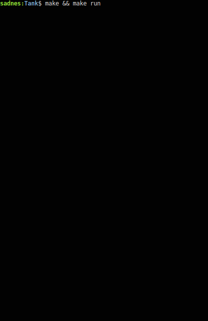

# Tank Game v0.1



#### You can change almost everything with editing defines' values.

 - Such as set **FRIEND_FIRE** true for enable frind fire. 
 - Such as set **P1_DEFAULT_BODY_COLOR** which color you want in *"CharColor.h"* file. 

 You can compile and start to play with following command.
```sh
$ cd Tank
$ make && make run
```
 You can clean unnecessary files with following command.
```sh
$ make clean
```