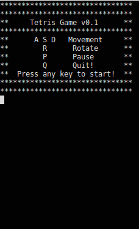

# Tetris Game v0.1



 You can compile and start to play with following command.
```sh
$ cd Tetris
$ make
$ ./Game.out
```
 You can clean unnecessary files with following command.
```sh
$ make clean
```