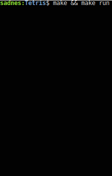

# Tetris Game v0.2



 You can compile and start to play with following command.
```sh
$ cd Tetris
$ make && make run
```
 You can clean unnecessary files with following command.
```sh
$ make clean
```